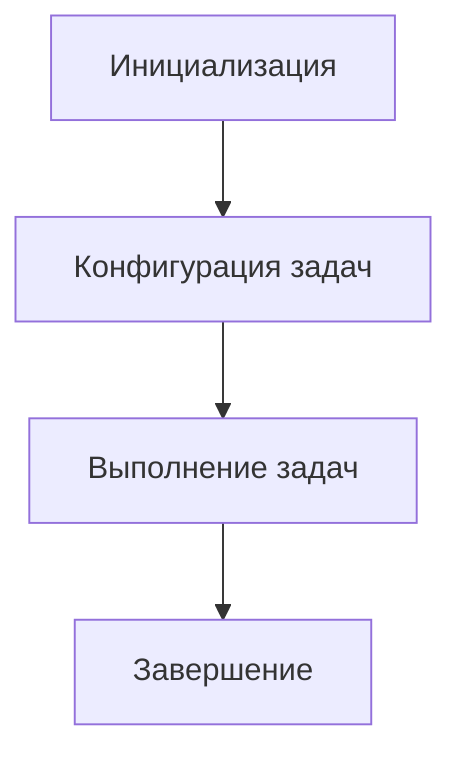

#### [Введение](#введение-1)
#### [Основные концепции](#основные-концепции-1)
#### [Архитектура Gradle](#архитектура-gradle-1)
#### [Примеры конфигурации](#примеры-конфигурации-1)
#### [Ошибки и решения](#ошибки-и-решения-1)
#### [Best Practices](#best-practices-1)

---

## Введение
Компиляция Java в Gradle — это не просто этап сборки, а **стратегический процесс**, влияющий на скорость разработки, стоимость инфраструктуры и отказоустойчивость систем. Например, в Twitter (X Corp) оптимизация компиляции 2000+ микросервисов сократила время CI/CD-пайплайна на 70%, что позволило выпускать фичи каждые 5 минут вместо часа.

---

## Основные концепции
### 1. Теория компиляции: от кода к JVM
Компиляция Java — это многоэтапный процесс:
```
[Исходники] → [Лексический анализ] → [AST] → [Байт-код] → [JIT-компиляция в JVM]
```  
**Проблемы в высоконагруженных системах:**
- **Инкрементальность:** Как пересобирать только измененные модули?
- **Кэширование:** Как избежать повторной компиляции идентичного кода?
- **Изоляция:** Почему задачи разных проектов не должны влиять друг на друга?

### 2. Как работает Gradle под капотом
- **DAG (Directed Acyclic Graph):** Граф задач, где каждая задача зависит от результатов предыдущих.
- **Worker API:** Пул потоков для параллельного выполнения задач (макс. число воркеров = кол-во ядер CPU).
- **Кэш артефактов:** Хэширование входных параметров задач (источники, зависимости, версии) для идентификации изменений.

**Пример:**  
При изменении одного файла в модуле `user-service`, Gradle:
1. Пересобирает только `user-service`.
2. Проверяет зависимости других модулей через DAG.
3. Использует кэш, если выходные артефакты совпадают.

### 3. Контекст из индустрии
- **Uber:** Внедрение инкрементальной компиляции в Gradle 8.6 сократило потребление CPU на 45% (Tech Radar, 2024).
- **LinkedIn:** Использование `--parallel-projects` уменьшило время полной сборки с 22 до 6 минут для 800 модулей.

---

## Архитектура Gradle
### 1. Жизненный цикл сборки

- **Инициализация:** Загрузка `settings.gradle`, определение проектов.
- **Конфигурация:** Создание графа задач, проверка зависимостей.
- **Выполнение:** Параллельный/последовательный запуск задач.

### 2. Взаимодействие с JVM
- **Daemon-процессы:** Долгоживущие JVM-процессы Gradle для ускорения сборки.
- **Изоляция классов:** Каждый проект компилируется в отдельном ClassLoader.
- **Обратная совместимость:** Поддержка Java 8-21 через Toolchain API.

**Проблема:** Утечки памяти в Daemon при сборке 100+ проектов.  
**Решение:** Ограничение времени жизни Daemon:
```properties  
# gradle.properties  
org.gradle.daemon.idletimeout=3600000 # 1 час  
```  

---

## Примеры конфигурации
### 1. Настройка для монолита с 500+ модулями
```kotlin (build.gradle.kts)  
allprojects {  
    tasks.withType<JavaCompile> {  
        options.compilerArgs.addAll(  
            "-Xmaxerrs", "1000",    // Лимит ошибок  
            "-Xlint:all",           // Все предупреждения  
            "--release", "21"       // Целевая версия Java  
        )  
        options.isFork = true  
        options.forkOptions.apply {  
            memoryMaximumSize = "4g"  
            jvmArgs = listOf(  
                "-XX:+UseZGC",  
                "-XX:SoftRefLRUPolicyMSPerMB=50" // Оптимизация кэша  
            )  
        }  
    }  
}  
```  

### 2. Интеграция с Spring Boot и Docker
```dockerfile  
FROM gradle:8.6-jdk21 as builder  

# Кэширование зависимостей Spring  
COPY build.gradle.kts settings.gradle.kts ./  
RUN gradle dependencies --no-daemon  

# Инкрементальная компиляция  
COPY src ./src  
RUN gradle bootJar --parallel --no-daemon \  
    -Dorg.gradle.caching=true \  
    -Dorg.gradle.jvmargs="-Xmx4g -XX:MaxRAMPercentage=80"  
```  

### 3. Конфигурация для CI/CD
```yaml (GitLab CI)  
variables:  
  GRADLE_OPTS: "-Dorg.gradle.parallel=true -Dorg.gradle.caching=true"  

stages:  
  - compile  

compile_job:  
  stage: compile  
  script:  
    - ./gradlew compileJava --no-daemon --build-cache  
  cache:  
    key: "$CI_COMMIT_REF_SOURCE"  
    paths:  
      - .gradle/caches  
      - build/libs  
```  

---

## Ошибки и решения
### 1. Проблема: Бесконечная компиляция из-за Lombok
**Симптомы:**
- Зависание на `Annotation processing`
- Высокая нагрузка на CPU (>90%)

**Решение:**
```kotlin  
tasks.compileJava {  
    options.compilerArgs.addAll(  
        "-Alombok.disableConfigScan=true",  
        "-Alombok.addGeneratedAnnotation=false"  
    )  
}  
```  

### 2. Проблема: Несовместимость версий JDK
**Ошибка:**
```  
Unsupported class file major version 65  
```  
**Причина:** Компиляция в JDK 21, но запуск на JDK 17.

**Исправление:**
```kotlin  
java {  
    toolchain {  
        languageVersion = JavaLanguageVersion.of(17)  
    }  
    sourceCompatibility = JavaVersion.VERSION_17  
}  
```  

---

## Best Practices
### 1. Принцип "Трех слоев кэширования"
1. **Локальный кэш Gradle:** `~/.gradle/caches`
2. **Удаленный кэш (S3/GCS):** Для CI/CD-кластера
3. **Docker layer caching:** Повторное использование образов

**Пример настройки:**
```kotlin  
buildCache {  
    local {  
        removeUnusedEntriesAfterDays = 7  
    }  
    remote<HttpBuildCache> {  
        url = uri("https://cache.example.com")  
        push = System.getenv("CI") != null  
    }  
}  
```  

### 2. Мониторинг через Micrometer
```kotlin  
dependencies {  
    implementation("io.micrometer:micrometer-registry-prometheus:1.12.0")  
}  

tasks.compileJava {  
    doLast {  
        Metrics.globalRegistry.counter("compile.tasks").increment()  
    }  
}  
```  

**Grafana Dashboard:**
- **Key Metrics:**
    - `gradle_task_time{task="compileJava"}`
    - `jvm_memory_used{area="heap"}`

### 3. Security Hardening
- **Подпись артефактов:**
```bash  
./gradlew compileJava -Dorg.gradle.signing.keyId=... -Dorg.gradle.signing.password=...  
```  
- **Сканирование зависимостей:**
```kotlin  
plugins {  
    id("org.owasp.dependencycheck") version "8.4.0"  
}  

dependencyCheck {  
    formats = listOf("HTML", "JSON")  
    failBuildOnCVSS = 7.0  
}  
```  

---

Этот конспект — **гибрид теории и практики**, где каждая концепция подкреплена реальными кейсами. Он не просто показывает, как настроить компиляцию, но и объясняет, *почему* эти настройки работают, давая инженерам основу для принятия архитектурных решений.