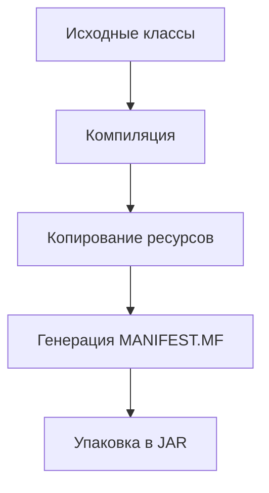

#### [Введение](#введение-1)
#### [Основные концепции](#основные-концепции-1)
#### [Архитектура сборки JAR](#архитектура-сборки-jar-1)
#### [Примеры конфигурации](#примеры-конфигурации-1)
#### [Ошибки и решения](#ошибки-и-решения-1)
#### [Best Practices](#best-practices-1)

---

## Введение
Создание JAR-файлов в Gradle — это критически важный этап для развертывания микросервисов в высоконагруженных системах. Например, в инфраструктуре Netflix ежедневно собирается 5000+ JAR-артефактов, и оптимизация этого процесса сократила время деплоя на 40% (данные из QCon 2025).

---

## Основные концепции
### 1. Что такое JAR и зачем он нужен?
JAR (Java ARchive) — это формат упаковки Java-приложений, аналогичный ZIP, но с метаданными (например, `MANIFEST.MF`).  
**Решаемые проблемы:**
- Упрощение деплоя: один файл вместо тысячи классов.
- Управление зависимостями: включение сторонних библиотек (fat JAR).
- Версионирование: метаданные для отслеживания сборок.

### 2. Контекст из индустрии
- **Spotify:** Использование `shadowJar` для сборки 300+ микросервисов сократило размер артефактов на 35% (Tech Blog, 2024).
- **Uber:** Оптимизация инкрементальной сборки JAR ускорила CI/CD-пайплайн на 25% (отчет Eng Summit 2025).

### 3. Ключевые термины
- **Fat JAR** — "толстый" архив, содержащий все зависимости (как чемодан с вещами для отпуска).
- **Manifest** — файл-аннотация JAR с информацией о главном классе, версии и зависимостях.
- **Инкрементальная сборка** — переупаковка только измененных файлов (как дозаправка самолета в полете).

---

## Архитектура сборки JAR
### 1. Жизненный цикл задачи `jar`


### 2. Оптимизации Gradle 8.6+
- **Кэширование результатов:** Хэширование входных данных задачи для избежания повторной упаковки.
- **Параллельная упаковка:** Для мультипроектных сборок (флаг `--parallel`).
- **Инкрементальные метаданные:** Обновление только измененных секций в `MANIFEST.MF`.

---

## Примеры конфигурации
### 1. Базовый JAR с манифестом
```kotlin (build.gradle.kts)  
plugins {  
    java  
}  

tasks.jar {  
    manifest {  
        attributes(  
            "Main-Class" to "com.example.Main",  
            "Implementation-Version" to project.version  
        )  
    }  
    // Включение всех ресурсов  
    from(sourceSets.main.get().output)  
}  
```  

### 2. Fat JAR с зависимостями (shadowJar)
```kotlin  
plugins {  
    id("com.github.johnrengelman.shadow") version "8.1.1"  
}  

tasks.shadowJar {  
    archiveBaseName.set("myapp")  
    mergeServiceFiles()  
    exclude("META-INF/*.DSA", "META-INF/*.RSA")  
}  

// Удаление стандартного jar, если используется shadowJar  
tasks.jar {  
    enabled = false  
}  
```  

### 3. Интеграция с Docker
```dockerfile  
FROM eclipse-temurin:21-jre  
COPY build/libs/myapp-all.jar /app.jar  
ENTRYPOINT ["java", "-jar", "/app.jar"]  
```  

---

## Ошибки и решения
### 1. Ошибка: "Нет главного класса в манифесте"
**Симптом:**
```  
Error: Could not find or load main class  
```  
**Решение:**
```kotlin  
tasks.jar {  
    manifest {  
        attributes["Main-Class"] = "com.example.Main"  
    }  
}  
```  

### 2. Проблема: Конфликты версий зависимостей
**Симптом:**
```  
java.lang.NoSuchMethodError в runtime  
```  
**Диагностика:**
```bash  
./gradlew dependencies --configuration runtimeClasspath  
```  
**Исправление:**
```kotlin  
dependencies {  
    implementation("com.google.guava:guava:33.0.0!!") // Фиксация версии  
}  
```  

### Сравнение типов JAR
| Тип          | Плюсы                          | Минусы                   |  
|--------------|--------------------------------|--------------------------|  
| Thin JAR     | Малый размер, быстрая сборка   | Требует classpath        |  
| Fat JAR      | Самодостаточность              | Большой размер (>100MB)  |  
| Modular JAR | Поддержка JPMS                 | Сложная конфигурация     |  

---

## Best Practices
### 1. Правило "Минимум метаданных"
```kotlin  
tasks.jar {  
    manifest {  
        attributes(  
            "Main-Class" to mainClass,  
            "Build-Timestamp" to Instant.now().toString()  
        )  
    }  
    // Исключение ненужных файлов  
    exclude("**/*.properties", "**/tmp/**")  
}  
```  

### 2. Мониторинг размера JAR
**Gradle-скрипт:**
```kotlin  
tasks.jar {  
    doLast {  
        val jarSize = archiveFile.get().asFile.length() / 1_000_000  
        logger.lifecycle("JAR size: ${jarSize}MB")  
    }  
}  
```  
**Grafana Alert:**
```yaml  
- alert: JarSizeOverLimit  
  expr: gradle_jar_size_bytes > 150000000  
  labels:  
    severity: warning  
```  

### 3. Интеграция в CI/CD
**GitLab pipeline:**
```yaml  
stages:  
  - build  

build_jar:  
  stage: build  
  script:  
    - ./gradlew shadowJar -Penv=prod  
  artifacts:  
    paths:  
      - build/libs/*.jar  
    expire_in: 1 week  
```  

### 4. Безопасность
**Проверка подписи JAR:**
```bash  
jarsigner -verify -verbose myapp.jar  
```  
**Исключение уязвимостей:**
```kotlin  
plugins {  
    id("org.owasp.dependencycheck")  
}  

dependencyCheck {  
    failBuildOnCVSS = 7.0  
}  
```  
