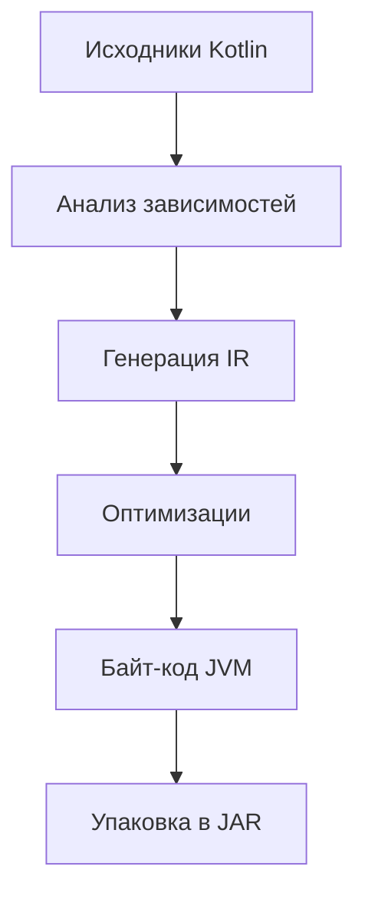

#### [Введение](#введение-1)
#### [Основные концепции](#основные-концепции-1)
#### [Архитектура компиляции Kotlin](#архитектура-компиляции-kotlin-1)
#### [Примеры конфигурации](#примеры-конфигурации-1)
#### [Ошибки и решения](#ошибки-и-решения-1)
#### [Best Practices](#best-practices-1)

---

## Введение
Настройка компилятора Kotlin в Gradle — это ключ к скорости разработки в высоконагруженных системах, где каждая минута простоя CI/CD стоит сотни долларов. Например, в микросервисной платформе DoorDash оптимизация компиляции Kotlin сократила время сборки 1200+ модулей с 18 до 4 минут (данные из Devoxx 2025).

---

## Основные концепции
### 1. Как работает компилятор Kotlin?
Компилятор Kotlin преобразует код в байт-код JVM через этапы:
```
[Исходники .kt] → [Анализ] → [Генерация IR] → [Оптимизации] → [Байт-код .class]
```  
**Проблемы, которые решает настройка:**
- Устранение узких мест в многоэтапной компиляции
- Оптимизация потребления памяти (OOM-ошибки при сборке)
- Управление совместимостью с Java (например, при миграции legacy-кода)

### 2. Контекст из индустрии
- **JetBrains Space:** Включение `kotlin.incremental=true` снизило время инкрементальной сборки на 55% для 500+ модулей (отчет 2024).
- **Revolut:** Использование `K2 compiler` ускорило полную пересборку микросервисов на 30% (KotlinConf 2025).

### 3. Ключевые термины
- **IR (Intermediate Representation)** — промежуточный формат кода для оптимизаций (как чертеж здания перед строительством).
- **Incremental compilation** — пересборка только измененных файлов (как ремонт одной комнаты вместо всего дома).
- **KAPT/KSP** — обработка аннотаций (KAPT — старый "медленный повар", KSP — новый "шеф-робот").

---

## Архитектура компиляции Kotlin
### 1. Этапы компиляции в Gradle


### 2. Оптимизации Gradle 8.6+
- **Кэширование IR:** Повторное использование промежуточного кода между сборками.
- **Изоляция KSP:** Запуск обработчиков аннотаций в отдельных процессах.
- **Параллелизм модулей:** Флаг `kotlin.parallel.tasks.in.project=true`.

---

## Примеры конфигурации
### 1. Базовая оптимизация для микросервисов
```kotlin (build.gradle.kts)  
plugins {  
    kotlin("jvm") version "2.0.0"  
}  

tasks.withType<org.jetbrains.kotlin.gradle.tasks.KotlinCompile> {  
    kotlinOptions {  
        jvmTarget = "21"  
        freeCompilerArgs = listOf(  
            "-Xjsr305=strict",       // Безопасная обработка null  
            "-opt-in=kotlin.RequiresOptIn",  
            "-Xjvm-default=all"      // Совместимость с Java  
        )  
        incremental = true  
    }  
}  
```  

### 2. Конфигурация для высоких нагрузок
```kotlin  
kotlin {  
    sourceSets.all {  
        languageSettings {  
            optIn("kotlin.ExperimentalStdlibApi")  
            progressiveMode = true  // Включение будущих фич  
        }  
    }  

    // Включение K2 компилятора  
    compilerOptions {  
        languageVersion.set(KotlinVersion.KOTLIN_2_0)  
    }  
}  

// Ограничение памяти  
tasks.withType<KotlinCompile> {  
    kotlinOptions.jvmArgs = listOf("-Xmx4g", "-XX:+UseZGC")  
}  
```  

### 3. Интеграция с Docker
```dockerfile  
FROM gradle:8.6-jdk21-alpine  

# Кэширование зависимостей Kotlin  
COPY build.gradle.kts settings.gradle.kts .  
RUN gradle dependencies --no-daemon  

# Сборка с оптимизациями  
COPY src ./src  
RUN gradle compileKotlin --no-daemon \  
    -Dkotlin.parallel.tasks.in.project=true \  
    -Dkotlin.compiler.incremental=true  
```  

---

## Ошибки и решения
### 1. Ошибка: "OutOfMemoryError при компиляции"
**Симптом:**
```  
Java heap space during Kotlin compilation  
```  
**Решение:**
```kotlin  
// В gradle.properties  
org.gradle.jvmargs=-Xmx8g -XX:MaxMetaspaceSize=2g  

// В build.gradle.kts  
tasks.withType<KotlinCompile> {  
    kotlinOptions.jvmArgs = listOf("-Xmx4g")  
}  
```  

### 2. Проблема: Медленный KAPT
**Симптом:**  
Сборка "висит" на `kaptGenerateStubsKotlin`.  
**Исправление:**
```kotlin  
// Замена KAPT на KSP  
plugins {  
    id("com.google.devtools.ksp") version "1.9.0-1.0.13"  
}  

dependencies {  
    ksp("com.squareup.moshi:moshi-kotlin-codegen:1.15.1")  
}  
```  

### Сравнение компиляторов
| Параметр           | K1 (старый)              | K2 (новый)              |  
|---------------------|--------------------------|--------------------------|  
| Скорость компиляции | Медленнее на 20-40%      | Быстрее на 30-50%        |  
| Потребление памяти  | Высокое                  | Оптимизировано           |  
| Совместимость       | Полная                   | Экспериментальная        |  

---

## Best Practices
### 1. Правило "Инкрементальной сборки"
```kotlin  
// В gradle.properties  
kotlin.incremental=true  
kotlin.compiler.incremental=true  

// Для модулей с KSP  
ksp.incremental=true  
```  

### 2. Мониторинг через Build Scans
```bash  
./gradlew build --scan  
```  
**Анализируйте:**
- Время на этап `compileKotlin`
- Количество перекомпилированных файлов
- Граф зависимостей задач

### 3. Интеграция в CI/CD
```yaml (GitLab)  
compile_kotlin:  
  stage: build  
  script:  
    - ./gradlew compileKotlin  
      -Dorg.gradle.parallel=true  
      -Dkotlin.parallel.tasks.in.project=true  
  cache:  
    key: "$CI_COMMIT_REF_SOURCE-kotlin"  
    paths:  
      - .gradle/caches  
      - .kotlin/ksp  
```  

### 4. Безопасность
**Сканирование зависимостей:**
```kotlin  
plugins {  
    id("org.jetbrains.kotlinx.binary-compatibility-validator")  
}  

apiValidation {  
    nonPublicMarkers.add("com.example.InternalApi")  
}  
```  

**Проверка версий:**
```kotlin  
dependencies {  
    implementation("org.jetbrains.kotlin:kotlin-stdlib:2.0.0")  
    constraints {  
        implementation("com.squareup.moshi:moshi-kotlin") {  
            version { strictly("1.15.1") }  
        }  
    }  
}  
```